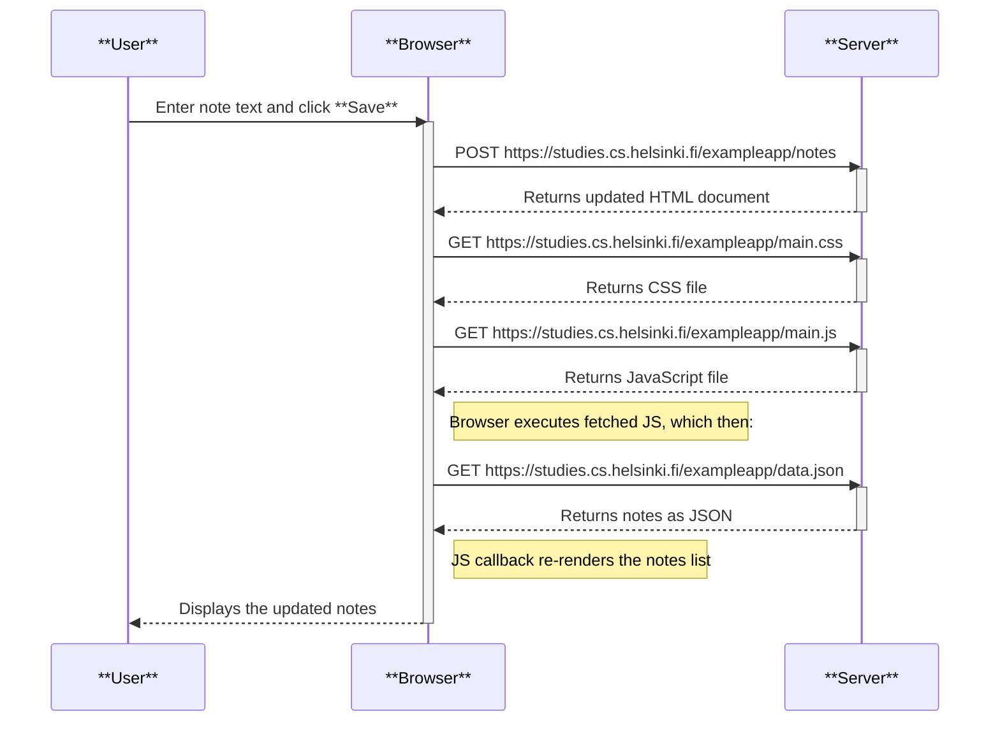
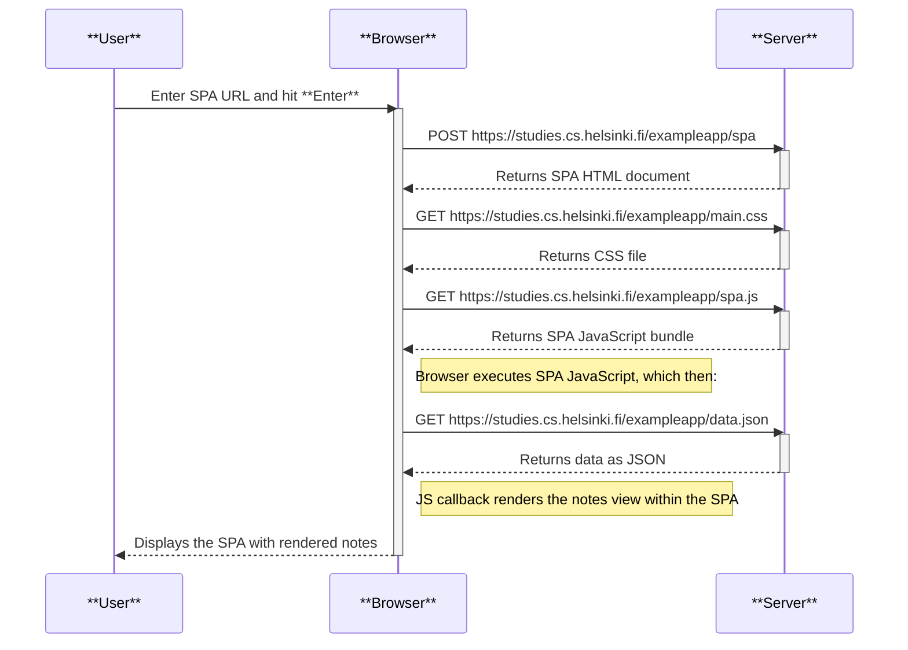
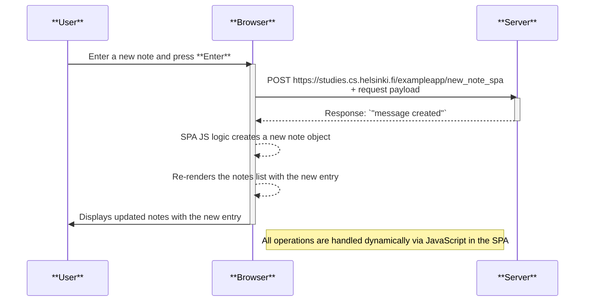

## Exercises: 0.4-0.6

#### 0.4) When user creates a new note:

The following sequence diagram illustrates the end‑to‑end flow when a user enters a note and clicks **Save**, showing how the browser and the server interact to render and persist the data.

#### 0.5) When user goes to single page app version of the notes app:

This sequence diagram shows how a Single‑Page Application (SPA) is loaded and initialized when the user navigates to the app URL.

#### 0.6) When the user creates a new note in the single page app:

The following sequence diagram illustrates what happens when a user adds a new note and presses **Enter** in the Single‑Page Application (SPA).

